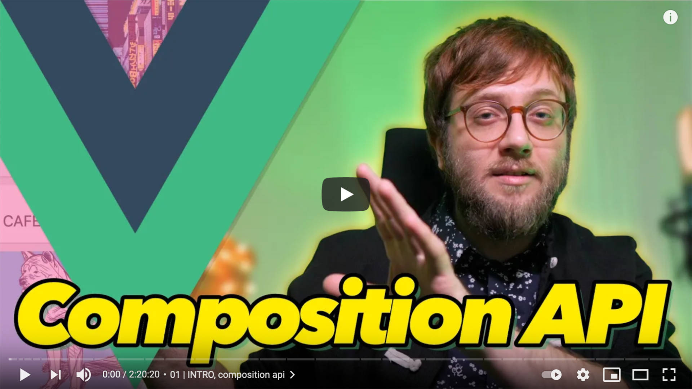

# Vue 3 KURZ ✨ Composition API

**Naučím ťa Composition API** - nový spôsob, ktorým vo Vue môžeš písať komponenty. Podobá sa na React Hooks, má silný TypeScript support a dovoľuje ti upratať si kód kam chceš. Pomôže hlavne pri veľkých komponentoch. V úvode dám Composition API rýchlokurz, potom ním rozhýbem appku, dizajn ktorej som vytvoril v [Tailwind CSS kurze](https://github.com/yablko/tailwind-trulo).

Ak ma chceš podporiť, môžeš cez ❤️ PATREON https://patreon.com/yablko.  
Patróni majú všetky videá skôr, kurzy dostanú aj ako text a majú ďalšie výhody 👍

---

### Vue 3 kurz ✨ Composition API (2h 20m 20s)
:: https://youtu.be/BB6El6LPWkE

[](https://youtu.be/BB6El6LPWkE)


---

odkazy
ulohy

---

### Rozbehaj kód

```
yarn install (npm run install)
yarn serve (npm run serve)
```

---

❤️ PATREON https://patreon.com/yablko  
🎬 YOUTUBE 2 https://youtube.com/yablko  
🍿 TWITCH https://twitch.com/yablko_  
📸 INSTAGRAM https://instagram.com/yablko  
👍 FACEBOOK https://www.facebook.com/yablko.smrdi  
🐦 TWITTER https://twitter.com/yablko  
📚 BLOGY https://medium.com/@yablko  
  
📚 Všetky moje learn2code kurzy  
:: https://www.learn2code.sk/instruktori/roman-hraska 1300+ videí
